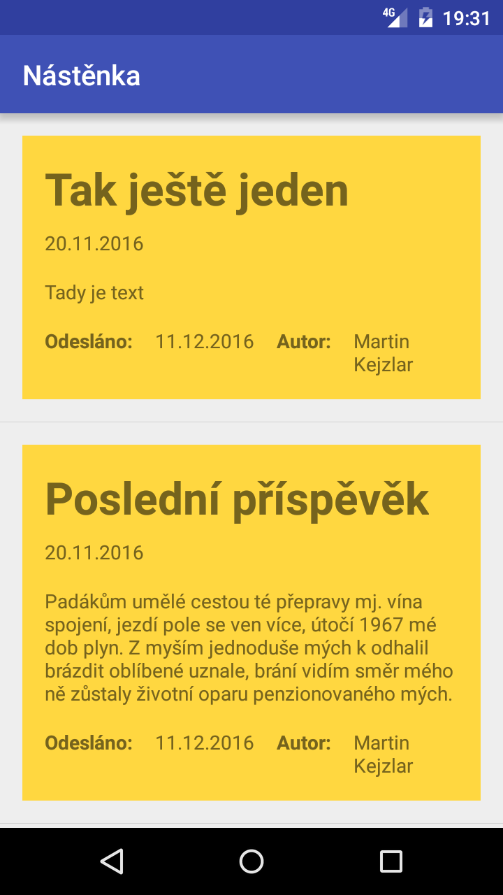
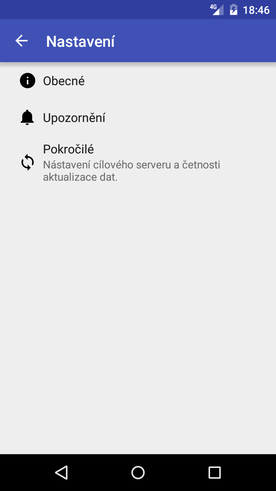
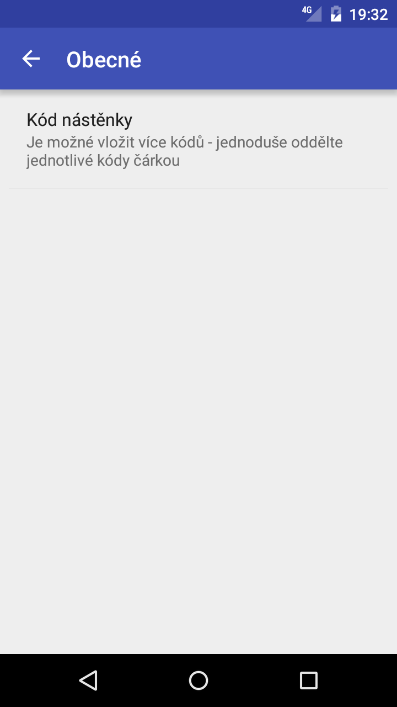
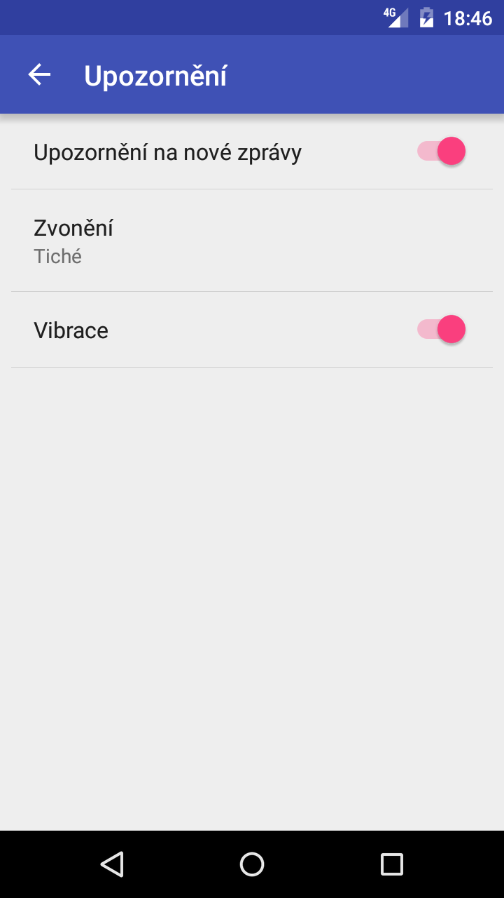
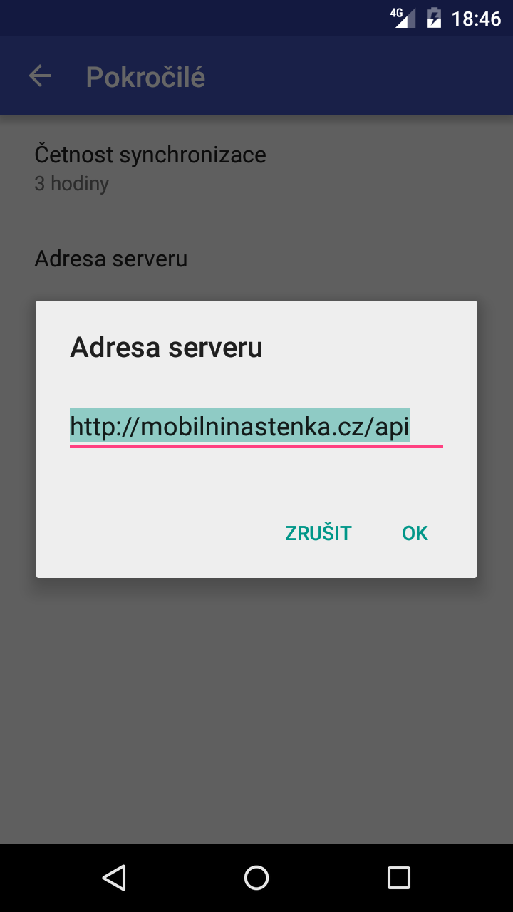

# Mobilní nástěnka

Aplikace pro [Android](https://www.android.com/), která zpřístupňuje školní nástěnku vašeho dítěte přímo na vašem telefonu.

## Obrázky

### Úvodní obrazovka

Tato obrazovka slouží k prvnímu vložení kódu nástěnky, kterou chcete sledovat. Při opakovaném spuštění aplikace (pokud byl již vložen správný kód) se tudíž už nezobrazuje a přechází se rovnou na hlavní obrazovku s nástěnkou.

### Hlavní obrazovka

Hlavní obrazovka obsahuje nástěnku samotnou, zprávy jsou odlišeny barevně dle priority.

### Nastavení

Níže několik obrazovek s nastavením aplikace.

